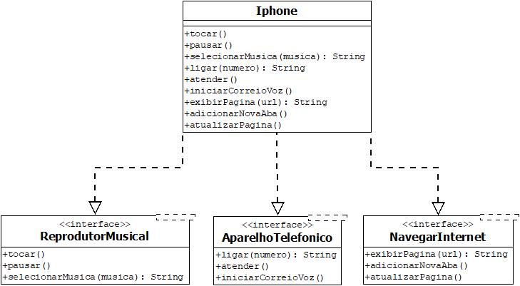

## DESAFIO DE PROJETO - BOOTCAMP SANTANDER PELA DIO

# Modelagem e diagramação de um componente de IPhone

Neste desafio de projeto, foi criado um diagrama de clasee, seguindo a UML, para apresentar os componentes de um IPhone.

📢 Também foi implementado um esboço das classes correspondetes em java.
